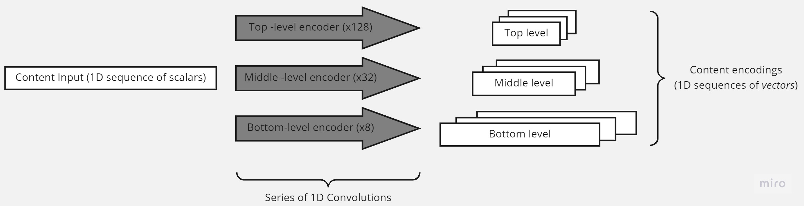
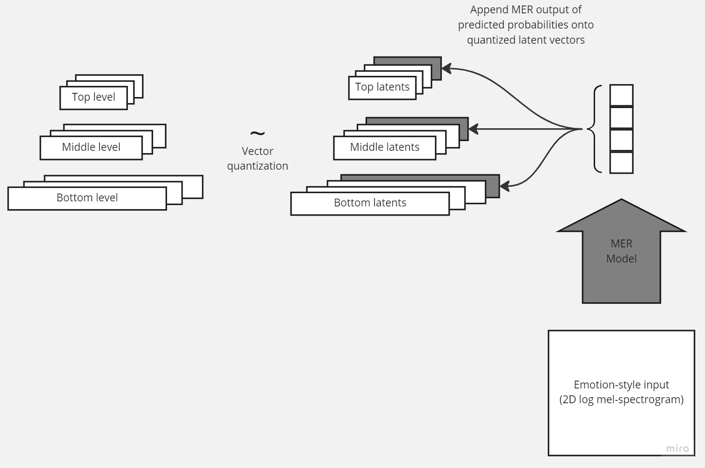
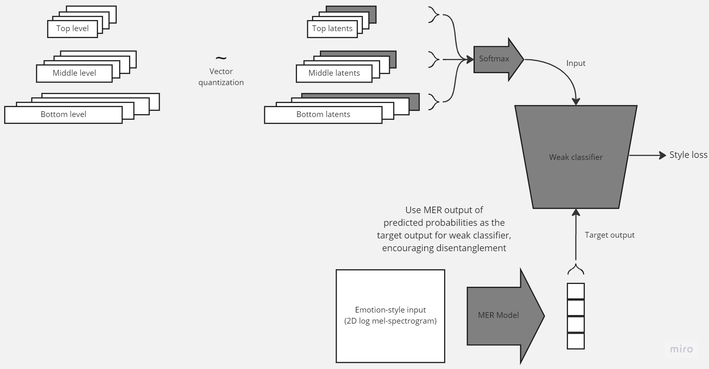
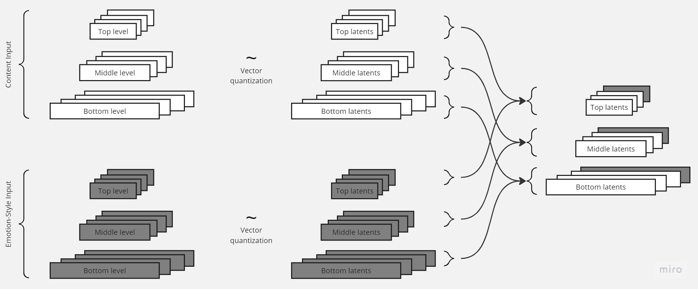
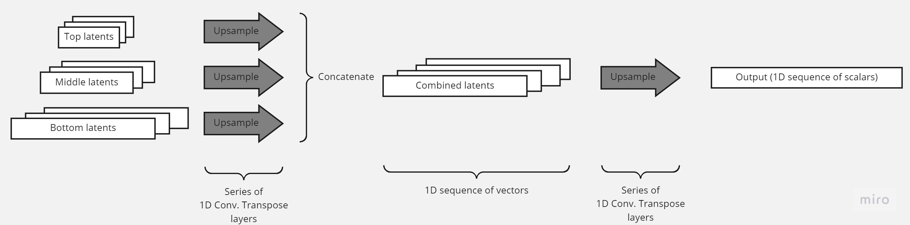

# Emotion-Style Transfer for Music
## Objective: Develop and train a model which can combine the *emotion* of one song with the *content* of another, in a manner similar to neural style transfer.
---
### Model architectures:

#### Encoder for both ESTM-1 and ESTM-2:

#### ESTM-1 latent space:

#### ESTM-2 latent space during training:

#### ESTM-2 latent space during deployment:

#### Upsampler and decoder for both ESTM-1 and ESTM-2:

---
### Folder descriptions:
1. `data`: contains .csv files which assign songs to train/test/validation sets, metrics, and other files relevant to data. *NOTE: the repo does not contain the actual audio files. Links to the datasets can be found below.*
2. `estm_v1_models`: contains trained ESTM-1 models in .h5 format, as well as the training statistics in .csv format.
3. `estm_v2_models`: contains trained ESTM-2 models in .h5 format, as well as the training statistics in .csv format.
4. `estm_v2_grid`: contains trained ESTM-2 models in .h5 format, as well as the training statistics in .csv format; these ESTM-2 models are the ones evaluated in the paper over the grid of hyperparameters.
5. `hvqvae_models`: contains trained hierchical VQ-VAE models in .h5 format, as well as the training statistics in .csv format; these models only take a content input and no style component.
6. `mer_models`: contains trained MER models in .h5 format, as well as the trianing statistics in .csv format.
7. `notebooks`: contains Jupyter notebooks in .ipynb format; these notebooks are used to test, evaluate models, output audio, and produce plots. The notebooks also contain information about model hyperparameters.
8. `scripts`: contains .py and .slurm files which are used to train and test ESTM, hierarchical VQ-VAE, and MER models.
---
### Data sources:
* [DEAM](https://cvml.unige.ch/databases/DEAM/): used to train ESTM models and hierchical VQ-VAE models.
* [MER TAFFC](
http://mir.dei.uc.pt/resources/MER_audio_taffc_dataset.zip): used to train MER models (note: the link immediately downloads the dataset. To see the paper, go [here](https://ieeexplore.ieee.org/abstract/document/8327886)).
